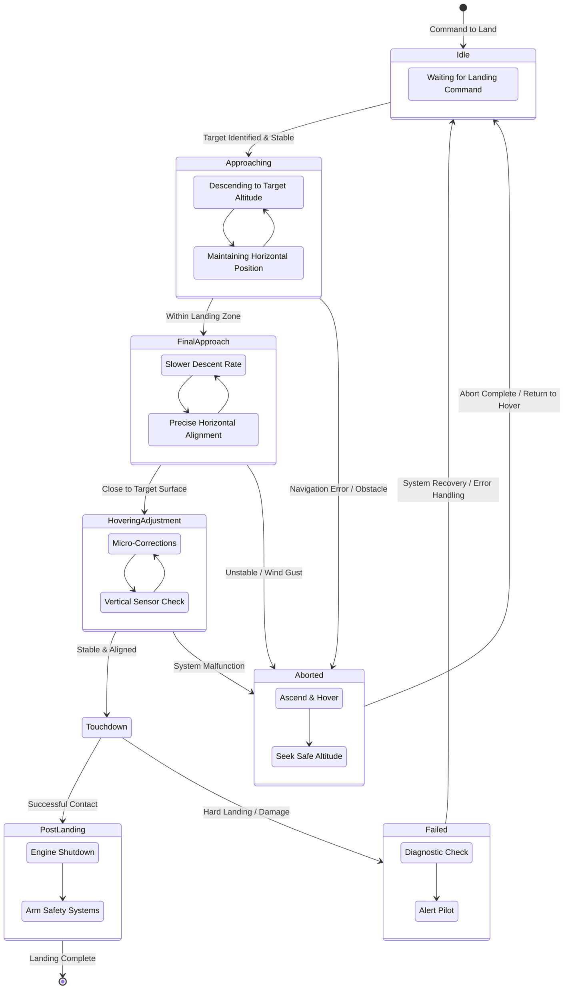

# Meeting Summary

Here's a summary of the weekly meeting:

**1. High-Level Summary**

The team is preparing for a competition, focusing on developing an ML YOLO model for a balloon dataset and the need for thorough testing. A key discussion revolved around creating an overall state diagram, with the decision made to proceed with simulations in Gazebo.

**2. Key Decisions**

*   Work on simulations in Gazebo.

**3. Risks and Blockers**

*   Some team members on M-series Macs are unable to use Gazebo, requiring alternative task assignments.

**4. Action Items**

*   [ ] Mac M-series people who can't use Gazebo can work on other tasks.

---

# AI Research Findings

## Research: Best Cameras for ML Drones

**Clear Explanation:**

When selecting a camera for a machine learning (ML) drone, the primary goal is to capture high-quality visual data that an ML model can effectively process. This involves considering factors beyond just megapixels. Key aspects include sensor size and type, resolution, frame rate, lens characteristics, and the camera's ability to handle varying lighting conditions. The camera needs to be compatible with the drone's processing capabilities, often meaning it should be lightweight and power-efficient.

**Guidance:**

1.  **Sensor Resolution and Size:** Higher resolution (e.g., 4K and above) allows for more detail, crucial for tasks like object detection in complex scenes or fine-grained classification. Larger sensor sizes (e.g., 1-inch or larger) generally perform better in low light and offer shallower depth of field for better subject isolation.
2.  **Frame Rate:** For real-time ML applications (e.g., obstacle avoidance, object tracking), a high frame rate is essential to capture dynamic scenes without motion blur. Aim for at least 30 fps, with 60 fps or higher being ideal for fast-moving targets.
3.  **Lens Quality and Field of View (FoV):** A good quality lens minimizes distortion and chromatic aberration, ensuring accurate image data for ML. The FoV should be chosen based on the application. A wider FoV is good for surveying larger areas, while a narrower FoV is better for detailed inspection of specific objects.
4.  **Low Light Performance:** Drones often operate in diverse lighting conditions. Cameras with good low-light performance (high ISO capability, wide dynamic range) are crucial to avoid noisy or underexposed images.
5.  **Global Shutter vs. Rolling Shutter:** For applications involving fast motion, a global shutter is highly preferable as it captures the entire frame simultaneously, preventing "jello effect" distortion. Rolling shutters are more common and cheaper but can be problematic for fast-moving drones.
6.  **Interface and Data Transfer:** Consider how the camera interfaces with the drone's onboard computer (e.g., MIPI CSI, USB). The bandwidth of this interface will determine the maximum resolution and frame rate you can reliably transfer.
7.  **Power Consumption and Size/Weight:** Drones have limited payload and battery life. Cameras should be lightweight and power-efficient to maximize flight time and maneuverability.

**Best Practices:**

*   **Match Camera to Application:** Don't overspend on a camera with features you don't need. A drone for basic object detection might not require the same high-end sensor as one for autonomous navigation in cluttered environments.
*   **Test in Real-World Conditions:** Always test your chosen camera under the typical lighting and environmental conditions your drone will operate in.
*   **Consider Integrated Solutions:** Some drone platforms offer integrated camera systems specifically designed for AI tasks, simplifying integration and optimization.
*   **Prioritize Data Quality:** The best camera is one that provides clean, detailed, and consistent data for your ML model.

**References or Tool Suggestions:**

*   **DJI Zenmuse Series:** DJI offers a range of high-quality cameras, some specifically tailored for professional aerial imaging and inspection, which can be adapted for ML.
*   **FLIR Vue Series:** For thermal imaging applications, FLIR cameras are industry-leading.
*   **Raspberry Pi Camera Modules:** For smaller, more budget-friendly drone projects, the Raspberry Pi camera modules (e.g., High Quality Camera) are a good starting point, though they often use rolling shutters.
*   **Custom Solutions:** For advanced research or specific requirements, consider industrial cameras with global shutters and MIPI CSI interfaces, often found from manufacturers like Basler, Allied Vision, or Leopard Imaging.
*   **NVIDIA Jetson Ecosystem:** If using a Jetson board, explore cameras that are well-supported by the NVIDIA Jetson ecosystem for easier integration and accelerated processing.

---

## Research: State Diagram for Precision Landing for a Drone

**Clear Explanation:**

A state diagram is a visual representation of the different states a system can be in and the transitions between those states. For a drone performing precision landing, it illustrates the logical flow of operations from initiating the landing sequence to successfully touching down. Each state represents a distinct phase of the landing process, and transitions are triggered by specific conditions or events.

**Guidance:**

The state diagram should encompass the key phases of precision landing, including:

*   **Initiation:** The point at which the drone begins the landing procedure.
*   **Approaching:** Descending towards the landing zone but still at a significant altitude.
*   **Final Approach:** Descending at a controlled rate and positioning for touchdown.
*   **Hovering/Adjustment:** Making fine positional adjustments just before or during the final descent.
*   **Touchdown:** The moment the drone's landing gear makes contact with the ground.
*   **Post-Landing:** Actions taken after a successful touchdown.
*   **Aborted/Failed:** States representing the cancellation or failure of the landing attempt.

**Key States and Transitions:**

Here's a conceptual state diagram:

**Explanation of States:**

*   **Idle:** The drone is operational but not actively landing.
*   **Approaching:** The drone begins its descent and maneuvers towards the general landing area. This phase might involve initial altitude reduction and coarse horizontal adjustments.
*   **Final Approach:** The drone is closer to the landing site, employing a slower descent rate and fine-tuning its horizontal position.
*   **Hovering/Adjustment:** The drone may hover briefly or make very small, precise movements to align perfectly with the landing spot, often using downward-facing sensors.
*   **Touchdown:** The moment of physical contact with the landing surface.
*   **Post-Landing:** Actions taken after successful touchdown, such as engine shutdown and engaging safety mechanisms.
*   **Aborted:** The landing sequence is intentionally stopped due to external factors (e.g., pilot command, unexpected obstacle) or internal decision-making. The drone will typically ascend to a safe altitude.
*   **Failed:** The landing attempt resulted in an error, such as a hard landing, system malfunction during descent, or an inability to reach the target.

**Best Practices:**

*   **Clear and Distinct States:** Each state should represent a unique and well-defined phase of the landing process.
*   **Well-Defined Transitions:** Transitions should be triggered by logical conditions (e.g., altitude, distance, sensor readings, system status) and be unambiguous.
*   **Robust Error Handling:** Include states for aborted and failed landings with clear recovery or alert mechanisms.
*   **Sensor Integration:** The states and transitions should implicitly rely on various sensors (GPS, IMU, lidar, vision sensors, altimeter) for accurate state determination and transition triggers.
*   **Feedback Loops:** For precision landing, internal feedback loops (e.g., PID controllers for altitude and position) operate within states like "Final Approach" and "Hovering/Adjustment" to maintain stability.
*   **Visual Representation:** Using tools like Mermaid or standard UML state machine diagrams enhances clarity and communication.

**References or Tool Suggestions:**

*   **Mermaid:** A JavaScript-based diagramming and charting tool that renders Markdown-inspired text definitions into graphics. Useful for creating state diagrams directly in markdown.
*   **draw.io (now diagrams.net):** A free online diagramming tool that supports various diagram types, including flowcharts and state machines.
*   **Lucidchart:** A popular online diagramming tool with extensive features for creating complex state diagrams.
*   **UML (Unified Modeling Language) State Machine Diagrams:** The standard notation for state diagrams, which can be learned and applied using various software tools.
*   **Drone Autopilot Software Documentation:** Examining how established drone autopilots (e.g., ArduPilot, PX4) handle landing sequences can provide practical insights.
